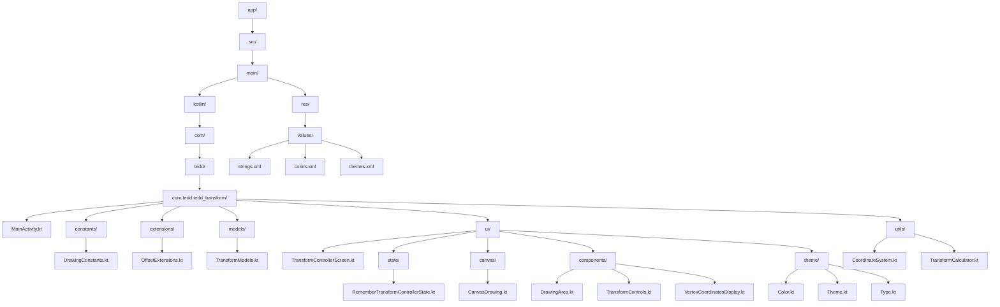
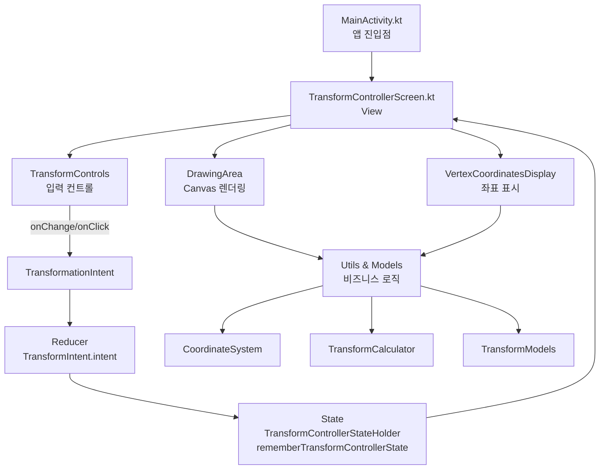
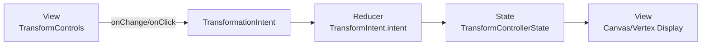
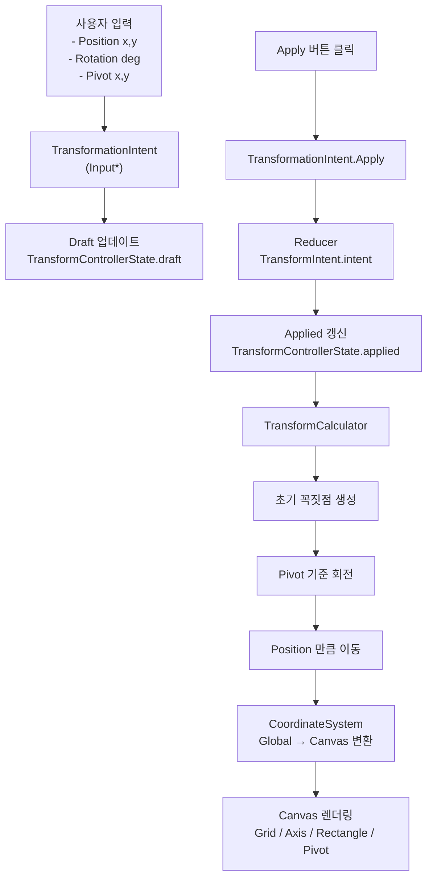
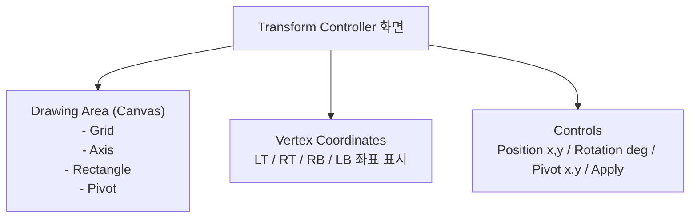

# tedd_transformation

## 문서 목차

- [주요 기능](#주요-기능)
- [빠른 시작](#빠른-시작)
- [프로젝트 구조](#프로젝트-구조)
- [계층 구조](#계층-구조)
- [핵심 컴포넌트 상세](#핵심-컴포넌트-상세)
  - [CoordinateSystem](#1-좌표-시스템-coordinatesystemkt)
  - [TransformCalculator](#2-변환-계산기-transformcalculatorkt)
  - [CanvasDrawing](#2-1-캔버스-드로잉-canvasdrawingkt)
- [UI 컴포넌트](#4-ui-컴포넌트)
- [상태 관리](#상태-관리-단일-컨트롤러-상태)
- [개념 정리(좌표계/Position/Pivot)](#-개념-정리-position-vs-pivot-좌표계)
- [입력 규칙 및 폴백](#입력-규칙-및-폴백-동작)
- [동작 원리 흐름도](#동작-원리)
- [MVI 아키텍처](#mvi-아키텍처)

### 주요 기능

- **실시간 좌표 변환**: Position, Rotation, Pivot 파라미터 입력
- **시각적 그리드 시스템**: −250 ~ 250 범위의 좌표계 (50단위 그리드)
- **정점 좌표 계산**: 변환 후 사각형 네 꼭짓점의 정확한 좌표 표시
- **피벗 기반 회전**: 임의의 피벗 점을 중심으로 회전

### 프로젝트 구조



### 계층 구조



## 핵심 컴포넌트 상세

### 1. 좌표 시스템 (CoordinateSystem.kt)

**역할**: Global 좌표계와 Android Canvas 좌표계 간 변환

```kotlin
class CoordinateSystem(canvasWidth, canvasHeight) {
    // Global 좌표 → Canvas 좌표
    fun toCanvasX(globalX: Float): Float
    fun toCanvasY(globalY: Float): Float
    fun toCanvas(global: Offset): Offset
}
```

#### 동작 원리

- 입력 파라미터
  - `canvasWidth`, `canvasHeight`: Compose `Canvas`의 실제 픽셀 크기. `DrawScope.size`에서 전달됩니다.
  - 그리드 가이드 범위: `Grid.MIN = -250f`, `Grid.MAX = 250f` → `coordRange = MAX - MIN = 500f`.

- 스케일 계산
  - `scale = min(canvasWidth, canvasHeight) / coordRange`
    - 짧은 변을 기준으로 스케일을 잡아 ±250 정사각형 가이드가 화면에 맞게 들어갑니다.
    - 화면 비율에 따라 상/하 또는 좌/우에 여백이 생길 수 있습니다.

- 좌표 매핑 공식 (Global → Canvas)
  - X: `x_canvas = (x_global - MIN) * scale`
  - Y: `y_canvas = canvasHeight - (y_global - MIN) * scale`
  - 오프셋: `toCanvas(Offset(x, y)) = Offset(x_canvas, y_canvas)`

- 의미/특징
  - Global 좌표계는 X→오른쪽+, Y→위쪽+이며, 가이드 범위(−250..250) 내에서 원점(0,0)은 중앙에 위치합니다.
  - 가이드 범위는 −250..250이며, 매핑 자체는 범위를 넘는 좌표에도 그대로 적용되어 그리드 밖으로 그려질 수 있습니다.
  - 두 축에 동일한 스케일을 사용하므로 비율 왜곡이 없습니다(정사각형 유지).

- 예시
  - `(MIN, MIN)=(-250, -250)` → `(0, canvasHeight)`
  - `(0, 0)` → `(250 * scale, canvasHeight - 250 * scale)`
  - `(MAX, MAX)=(250, 250)` → `(500 * scale, canvasHeight - 500 * scale)`

**좌표계 구분 (Local / Global / Canvas)**
- **Local 좌표계**: 도형(사각형)의 내부 좌표계. 원점은 사각형의 Left-Bottom(좌하단), X→오른쪽+, Y→위쪽+. 초기 정점은 `(0,0)=LeftBottom`, `(RECT_SIZE,0)=RightBottom`, `(RECT_SIZE,RECT_SIZE)=RightTop`, `(0,RECT_SIZE)=LeftTop` 기준으로 정의됩니다.
- **Global 좌표계**: X→오른쪽+, Y→위쪽+. 가이드 범위는 −250..250이며, 원점(0,0)은 가이드의 중앙에 위치합니다.
- **Canvas 좌표계**: Android 픽셀 좌표. 좌상단이 원점, X→오른쪽+, Y→아래쪽+. `CoordinateSystem`이 Global ⇄ Canvas 변환을 담당합니다.

### 2. 변환 계산기 (TransformCalculator.kt)

**역할**: 회전 및 변환 행렬 계산

```kotlin
object TransformCalculator {
    // 변환 후 정점 좌표 계산 (Global)
    fun calculateVertices(state: TransformState): List<Vertex>

    // 변환 후 정점 좌표 계산 (Canvas)
    fun calculateTransformedVertices(
        state: TransformState,
        coordSystem: CoordinateSystem
    ): List<Offset>
}
```

**변환 순서**:
1. **Local → Pivot 기준 회전**: 피벗 점을 원점으로 이동 → 회전 → 복원
2. **Translation**: 회전 결과를 `position - pivot` 만큼 이동

**회전 행렬**:
```
x' = (x - pivotX) * cos(θ) - (y - pivotY) * sin(θ) + pivotX
y' = (x - pivotX) * sin(θ) + (y - pivotY) * cos(θ) + pivotY
```

#### 동작 원리

- 입력값
  - `state.pivot (p)`: Local 좌표계의 회전 중심점
  - `state.position (P)`: Pivot의 Global 좌표(빨간 점)
  - `state.rotation (θ)`: 도 단위 각도(반시계 +); 내부에서 라디안으로 변환하여 `cos/sin` 사용

- 로컬 사각형 정의(좌하단 원점)
  - 정점 리스트 `v0..v3`는 아래 순서/위치로 생성됩니다.
    - `v0=(0, RECT_SIZE)` → LeftTop, `v1=(RECT_SIZE, RECT_SIZE)` → RightTop
    - `v2=(RECT_SIZE, 0)` → RightBottom, `v3=(0, 0)` → LeftBottom
  - 각 정점에 `VertexType`을 동일한 순서로 매핑합니다.

- 전역 좌표 계산식
  - 각 로컬 정점 `v`에 대해:
    - `V_global = R(θ) · (v - p) + P`
    - 여기서 `R(θ)`는 2×2 회전 행렬, `p=state.pivot`, `P=state.position`
  - 구현 상 동일식: `rotated = rotateAround(v, p)` → `global = rotated - p + P`

- 메서드별 반환
  - `calculateVertices(state)`: 위 공식을 통해 계산된 Global 좌표(수학적 Y 위로 +)를 `Vertex(type, x, y)`로 반환
  - `calculateTransformedVertices(state, coordSystem)`: 위 Global 좌표를 `CoordinateSystem`으로 Canvas 좌표(좌상단 원점, Y 아래로 +)로 변환하여 `Offset` 리스트 반환

- 각도/방향성
  - θ가 양수이면 수학적 좌표계(우핸드, Y 위로 +) 기준 반시계(CCW) 회전입니다. 현재 Global이 Y 위로 +이므로 직관적 CCW가 됩니다.

- 정밀도/성능
  - 각 프레임마다 `cos(θ), sin(θ)`를 1회만 계산하여 네 정점에 재사용합니다.
  - `RECT_SIZE`와 `INTERVAL`이 정수값이지만 계산은 `Float`로 수행합니다(좌표 표시 시 `%.2f`).

### 2-1. 캔버스 드로잉 (CanvasDrawing.kt)

**역할**: Global 좌표를 Canvas 픽셀 좌표로 변환해 격자/축/도형/라벨/피벗을 그립니다. `DrawingArea`에서 순서대로 호출됩니다.

구성 함수와 동작
- `drawGrid(coordSystem)`
  - 틱 순회: `tick = MIN..MAX`를 `INTERVAL` 간격의 정수로 순회해 부동소수 오차 없이 0축을 판별합니다.
  - 축 판별: `isAxis = (tick == 0)`.
  - 렌더링: x=tick 수직선과 y=tick 수평선을 전 범위에 그립니다.
    - 축(0): 검정(Black), 굵기 `AXIS_STROKE_WIDTH`
    - 일반: 회색(Gray), 굵기 `GRID_STROKE_WIDTH`
  - 좌표 변환: 각 선의 시작/끝 좌표를 `coordSystem.toCanvasX/Y(...)`로 변환합니다.

- `drawAxisLabels(coordSystem)`
  - 기준축: `x=0`, `y=0`의 캔버스 위치를 먼저 구해 라벨 기준선으로 사용합니다.
  - 라벨 범위: MIN..MAX를 INTERVAL 간격으로 순회하되 0은 제외(축 겹침 방지).
  - 배치: X축 라벨은 아래쪽(바닥선) 근처, Y축 라벨은 왼쪽 축 근처에 `LABEL_OFFSET_X/Y` 만큼 오프셋을 두고 `nativeCanvas.drawText`로 그립니다.

- `drawRectangle(state, coordSystem)`
  - 정점 계산: `TransformCalculator.calculateTransformedVertices(state, coordSystem)`로 Canvas 좌표의 네 꼭짓점을 구합니다.
  - 그리기: `Path`로 네 점을 연결해 채우기(연한 회색 alpha 0.8) 후 외곽선(검정, `RECT_STROKE_WIDTH`)을 그립니다.

- `drawPivotPoint(state, coordSystem)`
  - 위치: `state.position`(Pivot의 Global 좌표)을 Canvas로 변환 후 원을 그립니다.
  - 스타일: 빨간색(Red), 반지름 `PIVOT_RADIUS` 픽셀.

호출 순서와 레이어링
- `DrawingArea`의 `Canvas` 내부에서 다음 순서로 호출됩니다: 그리드 → 축 라벨 → 사각형 → 피벗 점.
- 결과적으로 피벗 점이 가장 위에 올라와 항상 보입니다.

### 3. 데이터 모델 (TransformModels.kt)

```kotlin
// 변환 상태
data class TransformState(
    val position: Offset = Offset.Zero,  // 이동
    val rotation: Float = 0f,            // 회전 각도 (도)
    val pivot: Offset = Offset.Zero      // 회전 중심점
)

// 정점 타입 (Sealed Class)
sealed class VertexType(@StringRes val stringResId: Int) {
    data object LeftTop
    data object RightTop
    data object RightBottom
    data object LeftBottom
}

// 정점 좌표
data class Vertex(
    val type: VertexType,
    val x: Float,
    val y: Float
)
```

### 4. UI 컴포넌트

#### DrawingArea (Canvas 렌더링)
- **Grid Lines**: 50단위 그리드 + 축 라인
- **Axis Labels**: 좌표 값 표시
- **Rectangle**: 변환된 사각형
- **Pivot Point**: 빨간 점으로 위치 표시

#### VertexCoordinatesDisplay
- 네 꼭짓점의 좌표를 실시간 표시- 형식: `Left-Top: (x, y)`

#### TransformControls
- **Position 입력**: "x, y" 형식
- **Rotation 입력**: 각도 (도)
- **Pivot 입력**: "x, y" 형식
- **Apply 버튼**: 변환 적용

## 상태 관리

입력 버퍼(draft)와 적용 상태(applied)를 하나로 묶은 `TransformControllerState`를 사용합니다. Compose에서는 `rememberTransformControllerState()` 한 번만 호출하면 됩니다. 내부적으로 `rememberSaveable` + `Saver`를 통해 구성 변경 후에도 상태가 복원됩니다.

### API

```kotlin
@Composable
fun rememberTransformControllerState(
    initial: TransformControllerState = TransformControllerState()
): TransformControllerStateHolder

@Stable
class TransformControllerStateHolder internal constructor(
  private val state: MutableState<TransformControllerState>
) {
  val value: TransformState get() = state.value.applied
  val draftValue: TransformDraft get() = state.value.draft

  fun updateApplied(block: (TransformState) -> TransformState)
  fun updateDraft(block: (TransformDraft) -> TransformDraft)
}

data class TransformControllerState(
  val applied: TransformState = TransformState(),
  val draft: TransformDraft = TransformDraft()
)

data class TransformDraft(
  val position: String = "",
  val rotation: String = "",
  val pivot: String = ""
)
```

### 사용 예시 (TransformControllerScreen)

```kotlin
val controller = rememberTransformControllerState()
val transformIntent = TransformIntent(controller)

DrawingArea(state = controller.value)
val vertices = TransformCalculator.calculateVertices(controller.value)

TransformControls(
  position = controller.draftValue.position,
  rotation = controller.draftValue.rotation,
  pivot = controller.draftValue.pivot,
  onPositionChange = { transformIntent.intent(TransformationIntent.InputPosition(it)) },
  onRotationChange = { transformIntent.intent(TransformationIntent.InputRotation(it)) },
  onPivotChange = { transformIntent.intent(TransformationIntent.InputPivot(it)) },
  onApply = { transformIntent.intent(TransformationIntent.Apply) }
)
```

### 저장/복원 동작

- Saver 직렬화 포맷: `String[8] = [applied.pos.x, applied.pos.y, applied.rotation, applied.pivot.x, applied.pivot.y, draft.position, draft.rotation, draft.pivot]`
- `rememberSaveable`로 구성 변경 및 시스템에 의한 프로세스 재생성(인스턴스 상태 복원 경로) 시 복원됩니다.

## MVI 아키텍처

본 프로젝트의 상태 관리는 MVI(Model–View–Intent) 패턴을 따릅니다. 단방향 데이터 흐름으로 입력 → 인텐트 → 리듀서 → 상태 → 렌더링 순으로 진행됩니다.

- Intent: `TransformationIntent` (입력 변화·Apply 등 사용자 의도)
- Reducer: `TransformIntent.intent(...)` (인텐트를 해석하여 `TransformControllerState`에 반영)
- State: `TransformControllerState(applied + draft)` (UI가 구독하여 렌더)
- View: `TransformControllerScreen` + `TransformControls` (입력 이벤트를 Intent로 디스패치)

흐름도



핵심 규칙
- UI는 상태를 직접 수정하지 않고, 항상 Intent를 통해서만 상태가 변경됩니다.
- Apply 버튼을 누를 때만 draft가 applied로 커밋되어 도형/좌표가 갱신됩니다.

## 개념 정리 (Position vs Pivot, 좌표계)

- Position (`TransformState.position`)
  - 의미: 피벗의 전역(Global) 좌표
  - 표시: Canvas의 빨간 점으로 렌더링됨
  - 용도: 회전이 끝난 도형을 Global 공간으로 평행 이동하는 기준

- Pivot (`TransformState.pivot`)
  - 의미: 도형(Local 좌표계)에서의 회전 중심점
  - 용도: 각 정점을 `pivot` 기준으로 회전

- 좌표계
  - Local: 사각형 로컬 좌표. 좌하단 원점, X→오른쪽+, Y→위쪽+ (초기 정점 정의 기준)
  - Global: X→오른쪽+, Y→위쪽+, 가이드 범위는 −250 ~ 250 (뷰포트 내에서 원점은 중앙)
  - Canvas: Android 픽셀 좌표. 좌상단 원점, X→오른쪽+, Y→아래쪽+
  - 변환: `TransformCalculator`는 Local→Global 변환(회전/이동), `CoordinateSystem`은 Global→Canvas 변환 담당

## 입력 규칙 및 폴백 동작

- Position, Pivot 입력
  - 형식: `"x, y"` (쉼표로 구분, 공백 허용, 소수 가능)
  - 예: `"0, 0"`, `"12.5, -30"`
  - 파싱 실패 시: `Offset.Zero`로 폴백됩니다. (경고/에러 UI 없음)

- Rotation 입력
  - 형식: 숫자(도 단위). 예: `"0"`, `"45"`, `"-30"`, `"12.5"`
  - 파싱 실패 시: `0f`로 폴백됩니다.

- 적용 버튼
  - `Apply` 클릭 시 현재 입력값이 `TransformState`로 반영됩니다.

## 동작 원리

### 변환 흐름



## 기술 스택

- **Language**: Kotlin
- **UI Framework**: Jetpack Compose
- **Build System**: Gradle (Kotlin DSL)
- **Min SDK**: 24 (Android 7.0)
- **Target SDK**: 36

### 주요 라이브러리

```kotlin
dependencies {
    // Jetpack Compose
    implementation("androidx.compose.ui")
    implementation("androidx.compose.material3")
    implementation("androidx.activity.compose")

    // Lifecycle
    implementation("androidx.lifecycle.runtime.ktx")
}
```

## UI 구성



## 테스트 시나리오

- 기본
  - Position: `0, 0`, Pivot: `0, 0`, Rotation: `0`
  - 기대: 사각형이 원점 기준으로 축과 정렬됨. 빨간 점은 중앙.

- 회전만
  - Position: `0, 0`, Pivot: `0, 0`, Rotation: `45`
  - 기대: 원점 기준 45° 회전. 정점 좌표는 대칭적이고 좌표 표시가 ±값으로 변함.

- Pivot 이동 + 회전
  - Position: `0, 0`, Pivot: `10, 10`, Rotation: `30`
  - 기대: 도형이 Local(10,10)을 중심으로 회전한 후 Global 원점에 위치. 빨간 점은 중심(0,0).

- Global 이동
  - Position: `100, 50`, Pivot: `0, 0`, Rotation: `0`
  - 기대: 도형이 우측/상단으로 평행 이동. 빨간 점은 (100,50).

- 혼합
  - Position: `100, 50`, Pivot: `10, 10`, Rotation: `30`
  - 기대: Local(10,10) 기준 회전 → Global(100,50)으로 이동. 좌표 표시와 Canvas 렌더링 일치.
